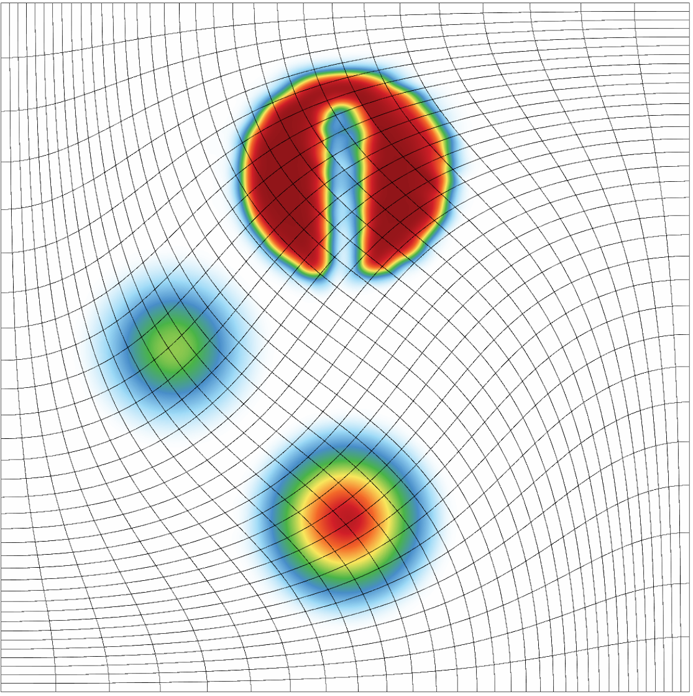
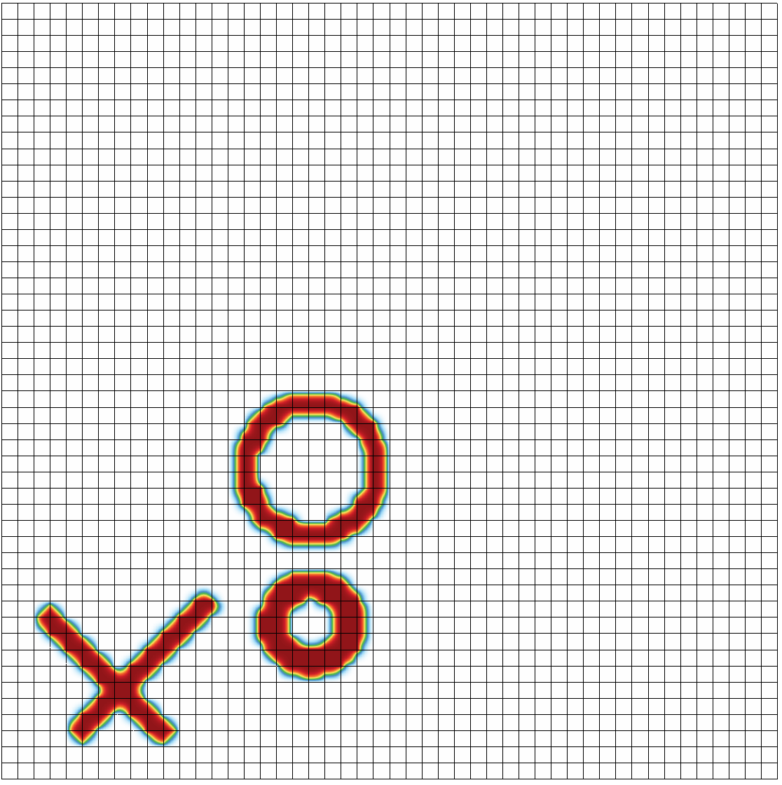

              ____                 __
             / __ \___  ____ ___  / /_  ____  _____
            / /_/ / _ \/ __ `__ \/ __ \/ __ \/ ___/
           / _, _/  __/ / / / / / / / / /_/ (__  )
          /_/ |_|\___/_/ /_/ /_/_/ /_/\____/____/

                  High-order Remap Miniapp

[](https://travis-ci.org/CEED/Remhos)
[](https://github.com/CEED/Remhos/actions?query=workflow%3Abuild-and-test-remhos)

## Purpose

**Remhos** (REMap High-Order Solver) is a miniapp that solves the pure advection
equations that are used to perform monotonic and conservative discontinuous
field interpolation (remap) as part of the Eulerian phase in Arbitrary
Lagrangian Eulerian (ALE) simulations.

Remhos combines discretization methods described in the following articles:

> R. Anderson, V. Dobrev, Tz. Kolev and R. Rieben <br>
> [Monotonicity in high-order curvilinear finite element arbitrary
   Lagrangian-Eulerian remap](https://doi.org/10.1002/fld.3965) <br>
> *International Journal for Numerical Methods in Fluids* 77(5), 2015, pp. 249-273.

> R. Anderson, V. Dobrev, Tz. Kolev, D. Kuzmin,
  M. Quezada de Luna, R. Rieben and V. Tomov <br>
> [High-order local maximum principle preserving (MPP) discontinuous Galerkin
   finite element method for the transport equation](https://doi.org/10.1016/j.jcp.2016.12.031) <br>
> *Journal of Computational Physics* 334, 2017, pp. 102-124.

> R. Anderson, V. Dobrev, Tz. Kolev, R. Rieben and V. Tomov <br>
> [High-order multi-material ALE hydrodynamics](https://doi.org/10.1137/17M1116453) <br>
> *SIAM Journal on Scientific Computing* 40(1), 2018, pp. B32-B58.

> H. Hajduk, D. Kuzmin, Tz. Kolev and R. Abgrall <br>
> [Matrix-free subcell residual distribution for Bernstein finite element
   discretizations of linear advection equations](https://doi.org/10.1016/j.cma.2019.112658) <br>
> *Computer Methods in Applied Mechanics and Engineering* 359, 2020.

> H. Hajduk, D. Kuzmin, Tz. Kolev, V. Tomov, I. Tomas and J. Shadid <br>
> [Matrix-free subcell residual distribution for Bernstein finite elements:
   Monolithic limiting](https://doi.org/10.1016/j.compfluid.2020.104451) <br>
> *Computers and Fluids* 200, 2020.


The Remhos miniapp is part of the [CEED software suite](http://ceed.exascaleproject.org/software),
a collection of software benchmarks, miniapps, libraries and APIs for
efficient exascale discretizations based on high-order finite element
and spectral element methods. See http://github.com/ceed for more
information and source code availability.

The CEED research is supported by the [Exascale Computing Project](https://exascaleproject.org/exascale-computing-project)
(17-SC-20-SC), a collaborative effort of two U.S. Department of Energy
organizations (Office of Science and the National Nuclear Security
Administration) responsible for the planning and preparation of a
[capable exascale ecosystem](https://exascaleproject.org/what-is-exascale),
including software, applications, hardware, advanced system engineering and early
testbed platforms, in support of the nation’s exascale computing imperative.

## Characteristics

The problem that Remhos is solving is formulated as a time-dependent system of
ordinary differential equations (ODEs) for the unknown coefficients of a
high-order finite element (FE) function. The left-hand side of this system is
controlled by a *mass matrix*, while the right-hand side is constructed
from a *advection matrix*.

Remhos supports two execution modes, namely, *transport* and *remap*, which
result in slightly different algebraic operators. The main difference
between the two modes is that in the case of remap, the mass and advection
matrices change in time, while they are constant for the transport case.

Remhos supports two options for deriving and solving the ODE system, namely the
*full assembly* and the *partial assembly* methods. Partial assembly is the main
algorithm of interest for high orders. For low orders (e.g. 2nd order in 3D),
both algorithms are of interest.

The full assembly option relies on constructing and utilizing global mass and
advection matrices stored in compressed sparse row (CSR) format.  In contrast,
the [partial assembly](http://ceed.exascaleproject.org/ceed-code) option defines
only the local action of those matrices, which is then used to perform all
necessary operations. As the local action is defined by utilizing the tensor
structure of the finite element spaces, the amount of data storage, memory
transfers, and FLOPs are lower (especially for higher orders).

Other computational motives in Remhos include the following:

- Support for unstructured meshes, in 2D and 3D, with quadrilateral and
  hexahedral elements. Serial and parallel mesh refinement options can be
  set via a command-line flag.
- Explicit time-stepping loop with a variety of time integrator options. Remhos
  supports Runge-Kutta ODE solvers of orders 1, 2, 3, 4 and 6.
- Discontinuous high-order finite element discretization spaces
  of runtime-specified order.
- Moving (high-order) meshes.
- Mass operator that is local per each zone. It is inverted by iterative or exact
  methods at each time step. This operator is constant in time (transport mode) or
  changing in time (remap mode). Options for full or partial assembly.
- Advection operator that couples neighboring zones. It is applied once at each
  time step. This operator is constant in time (transport mode) or
  changing in time (remap mode). Options for full or partial assembly.
- Domain-decomposed MPI parallelism.
- Optional in-situ visualization with [GLVis](http:/glvis.org) and data output
  for visualization and data analysis with [VisIt](http://visit.llnl.gov).

## Code Structure

- The file `remhos.cpp` contains the main driver with the time integration loop.
- The files `remhos_ho.hpp` and `remhos_ho.cpp` contain all methods that
  are used to obtain high-order (but not bounds-preserving) solutions of the problem.
- The files `remhos_lo.hpp` and `remhos_lo.cpp` contain all methods that
  are used to obtain low-order (but bounds-preserving) solutions
  of the problem.
- The files `remhos_fct.hpp` and `remhos_fct.cpp` contain all methods that
  combine already computed high-order and low-order solutions, thus obtaining a
  high-order and bounds-preserving solutions of the problem.
- The files `remhos_tools.hpp` and `remhos_tools.cpp` contain helper functions
  utilized by the main classes of the miniapp.

## Building

Remhos has the following external dependencies:

- *hypre*, used for parallel linear algebra, we recommend version 2.10.0b<br>
   https://computation.llnl.gov/casc/hypre/software.html

-  METIS, used for parallel domain decomposition (optional), we recommend [version 4.0.3](http://glaros.dtc.umn.edu/gkhome/fetch/sw/metis/OLD/metis-4.0.3.tar.gz) <br>
   http://glaros.dtc.umn.edu/gkhome/metis/metis/download

- MFEM, used for (high-order) finite element discretization, its GitHub master branch <br>
  https://github.com/mfem/mfem

To build the miniapp, first download *hypre* and METIS from the links above
and put everything on the same level as the `Remhos` directory:
```sh
~> ls
Remhos/  hypre-2.10.0b.tar.gz  metis-4.0.tar.gz
```

Build *hypre*:
```sh
~> tar -zxvf hypre-2.10.0b.tar.gz
~> cd hypre-2.10.0b/src/
~/hypre-2.10.0b/src> ./configure --disable-fortran
~/hypre-2.10.0b/src> make -j
~/hypre-2.10.0b/src> cd ../..
```
For large runs (problem size above 2 billion unknowns), add the
`--enable-bigint` option to the above `configure` line.

Build METIS:
```sh
~> tar -zxvf metis-4.0.3.tar.gz
~> cd metis-4.0.3
~/metis-4.0.3> make
~/metis-4.0.3> cd ..
~> ln -s metis-4.0.3 metis-4.0
```

Clone and build the parallel version of MFEM:
```sh
~> git clone https://github.com/mfem/mfem.git ./mfem
~> cd mfem/
~/mfem> make parallel -j
~/mfem> cd ..
```
The above uses the `master` branch of MFEM. See the [MFEM
building page](http://mfem.org/building/) for additional details.

(Optional) Clone and build GLVis:
```sh
~> git clone https://github.com/GLVis/glvis.git ./glvis
~> cd glvis/
~/glvis> make
~/glvis> cd ..
```
The easiest way to visualize Remhos results is to have GLVis running in a
separate terminal. Then the `-vis` option in Remhos will stream results directly
to the GLVis socket.

Build Remhos
```sh
~> cd Remhos/
~/Remhos> make
```
See `make help` for additional options.

## Running

#### Sample remap examples

Some *remap* mode sample runs for in 2D and 3D respectively are:
```sh
mpirun -np 8 remhos -m ./data/inline-quad.mesh -p 14 -rs 2 -rp 1 -dt 0.0005 -tf 0.6 -ho 1 -lo 2 -fct 3
mpirun -np 8 remhos -m ./data/cube01_hex.mesh -p 10 -rs 1 -o 2 -dt 0.02 -tf 0.8 -ho 1 -lo 4 -fct 2
```
This first of the above runs can produce the following plots (notice the `-vis` option)

<table border="0">
<td> 
<td> 
<td> <a href="https://glvis.org/live/?stream=../data/remhos.saved"></a>
</table>

#### Sample transport examples

Some *transport* mode sample runs for in 2D and 3D respectively are:
```sh
mpirun -np 8 remhos -m ./data/periodic-square.mesh -p 5 -rs 3 -rp 1 -dt 0.00025 -tf 0.8 -ho 1 -lo 4 -fct 3
mpirun -np 8 remhos -m ./data/periodic-cube.mesh -p 0 -rs 1 -o 2 -dt 0.014 -tf 8 -ho 1 -lo 4 -fct 2
```
This first of the above runs can produce the following plots (notice the `-vis` option)

<table border="0">
<td> 
<td> 
<td> 
</table>

## Verification of Results

To perform thorough testing, run the script `Remhos\autotest\test.sh` and
compare its output, `out_test.dat`, to `out_baseline.dat`.
Alternatively, verify the final mass (`mass`) and maximum value (`max`) for the runs listed below:

1.  `mpirun -np 8 remhos -m ./data/periodic-hexagon.mesh -p 0 -rs 2 -dt 0.005 -tf 10 -ho 1 -lo 2 -fct 2`
2.  `mpirun -np 8 remhos -m ./data/periodic-hexagon.mesh -p 0 -rs 2 -dt 0.005 -tf 10 -ho 1 -lo 4 -fct 2`
3.  `mpirun -np 8 remhos -m ./data/disc-nurbs.mesh -p 1 -rs 3 -dt 0.005 -tf 3 -ho 1 -lo 2 -fct 2`
4.  `mpirun -np 8 remhos -m ./data/disc-nurbs.mesh -p 1 -rs 3 -dt 0.005 -tf 3 -ho 1 -lo 4 -fct 2`
5.  `mpirun -np 8 remhos -m ./data/periodic-square.mesh -p 5 -rs 3 -dt 0.005 -tf 0.8 -ho 1 -lo 2 -fct 2`
6.  `mpirun -np 8 remhos -m ./data/periodic-square.mesh -p 5 -rs 3 -dt 0.002 -tf 0.8 -ho 1 -lo 4 -fct 2`
7.  `mpirun -np 8 remhos -m ./data/periodic-cube.mesh -p 0 -rs 1 -o 2 -dt 0.014 -tf 8 -ho 1 -lo 4 -fct 2`
8.  `mpirun -np 8 remhos -m ../mfem/data/ball-nurbs.mesh -p 1 -rs 1 -dt 0.02 -tf 3 -ho 1 -lo 4 -fct 2`
9.  `mpirun -np 8 remhos -m ./data/inline-quad.mesh -p 14 -rs 1 -dt 0.001 -tf 0.75 -ho 1 -lo 4 -fct 2`
10. `mpirun -np 8 remhos -m ./data/inline-quad.mesh -p 14 -rs 3 -dt 0.005 -tf 0.75 -ho 1 -lo 5 -fct 4 -ps -s 13`
11. `mpirun -np 8 remhos -m ./data/cube01_hex.mesh -p 10 -rs 1 -o 2 -dt 0.02 -tf 0.8 -ho 1 -lo 4 -fct 2`
12. `mpirun -np 8 remhos -m ./data/inline-quad.mesh -p 7 -rs 3 -o 1 -dt 0.01 -tf 20 -mono 1 -si 2`
13. `mpirun -np 8 remhos -m ./data/inline-quad.mesh -p 6 -rs 2 -o 1 -dt 0.01 -tf 20 -mono 1 -si 1`


| `run` | `mass` | `max` |
| ----- | ------ | ----- |
|  1. | 0.3888354875 | 0.9333315791 |
|  2. | 0.3888354875 | 0.9446390369 |
|  3. | 3.5982222    | 0.9995717563 |
|  4. | 3.5982222    | 0.9995717563 |
|  5. | 0.1623263888 | 0.7676354393 |
|  6. | 0.1623263888 | 0.7480960657 |
|  7. | 0.9607429525 | 0.7678305756 |
|  8. | 0.8087104604 | 0.9999889315 |
|  9. | 0.08479546709| 0.8156091428 |
| 10. | 0.09317738757| 0.9994170644 |
| 11. | 0.1197294512 | 0.9990312449 |
| 12. | 0.1570667907 | 0.9987771164 |
| 13. | 0.3182739921 | 1            |

An implementation is considered valid if the computed values are all within
round-off distance from the above reference values.

## Performance Timing and FOM

To appear soon.

## Versions

To appear soon.

## Contact

You can reach the Remhos team by emailing remhos@llnl.gov or by leaving a
comment in the [issue tracker](https://github.com/CEED/Remhos/issues).

## Copyright

The following copyright applies to each file in the CEED software suite,
unless otherwise stated in the file:

> Copyright (c) 2017, Lawrence Livermore National Security, LLC. Produced at the
> Lawrence Livermore National Laboratory. LLNL-CODE-734707. All Rights reserved.

See files LICENSE and NOTICE for details.
